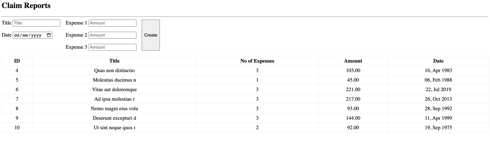

# quiz

In this assessment, we will be simulating a stripped down version of a claims app. 
In this app, there are two components, the `Report` and the `Expense`. Expenses represent the individual
receipts that the user wants to claim. Each expense needs to be added to a report. The structure of the 
application has been provided, with basic routing implemented and the MVC structure applied to the file
directory. 

Your task is to complete the implementation so that the 

## Instructions
1. Your task is to implement the 

## Setup

    CREATE TABLE reports (
      id int unsigned PRIMARY KEY AUTO_INCREMENT,
      title varchar(150) NOT NULL,
      status boolean DEFAULT 0 NOT NULL,
      date datetime NOT NULL
    );

    CREATE TABLE expenses (
      id int unsigned PRIMARY KEY AUTO_INCREMENT,
      amount DECIMAL(10,2),
      report_id int unsigned NOT NULL,
      FOREIGN KEY (report_id) REFERENCES reports (id)
      ON DELETE CASCADE
    );

